# 📧 Sistema de Invitación de Usuarios por Email - Implementación Completa

## 📋 Índice

1. [Resumen General](#resumen-general)
2. [Arquitectura del Sistema](#arquitectura-del-sistema)
3. [Componentes Frontend](#componentes-frontend)
4. [Server Actions](#server-actions)
5. [Autenticación y Confirmación](#autenticación-y-confirmación)
6. [Base de Datos](#base-de-datos)
7. [Flujo Completo](#flujo-completo)
8. [Configuración](#configuración)
9. [Manejo de Errores](#manejo-de-errores)

---

## 🎯 Resumen General

El sistema de invitación de usuarios permite a los administradores invitar nuevos usuarios por email. Los usuarios reciben un email de invitación, confirman su cuenta, y son automáticamente asignados a un cliente específico con permisos apropiados.

### Características Principales:

- ✅ Invitación por email usando Supabase Auth
- ✅ Asignación automática a un cliente específico
- ✅ Confirmación de cuenta por email
- ✅ Metadata de usuario (tipo, contraseña por defecto)
- ✅ Manejo de errores y rollback automático
- ✅ UI intuitiva con formularios validados

---

## 🏗️ Arquitectura del Sistema


---

## 🎨 Componentes Frontend

### 1. AddUsuarioButton - Botón Principal

**Archivo:** `components/usuarios/components/add-usuario-button.tsx`

```typescript
"use client";

import * as React from "react";
import { Plus } from "lucide-react";
import { Button } from "@/components/ui/button";
import { UsuarioForm } from "./usuario-form";
import { createUsuario, CreateUsuarioData } from "./usuario-actions";
import { getClientesActivos } from "./actions";
import { toast } from "sonner";

export function AddUsuarioButton() {
  const [open, setOpen] = React.useState(false);
  const [isLoading, setIsLoading] = React.useState(false);
  const [clientes, setClientes] = React.useState<
    Awaited<ReturnType<typeof getClientesActivos>>
  >([]);

  // Cargar clientes cuando se abre el modal
  React.useEffect(() => {
    if (open) {
      getClientesActivos().then(setClientes);
    }
  }, [open]);

  const handleSubmit = async (data: CreateUsuarioData) => {
    setIsLoading(true);
    try {
      const result = await createUsuario(data);
      toast.success("Invitación enviada exitosamente al usuario");
    } catch (error) {
      toast.error("Error al enviar la invitación");
      throw error;
    } finally {
      setIsLoading(false);
    }
  };

  return (
    <>
      <Button onClick={() => setOpen(true)}>
        <Plus className="mr-2 h-4 w-4" />
        Invitar Usuario
      </Button>
      <UsuarioForm
        open={open}
        onOpenChange={setOpen}
        clientes={clientes}
        onSubmit={handleSubmit}
        isLoading={isLoading}
      />
    </>
  );
}
```

### 2. UsuarioForm - Formulario de Invitación

**Archivo:** `components/usuarios/components/usuario-form.tsx`

**Características principales:**

- Validación con Zod schema
- Radio buttons para selección de UN cliente
- Upload de avatar opcional
- Manejo de estados de loading

```typescript
// Schema de validación
const usuarioSchema = z.object({
  nombre: z.string().optional(),
  email: z.string().optional(),
  avatar_url: z.string().optional(),
  clienteId: z.string().min(1, "Debe seleccionar un cliente"),
  is_active: z.boolean(),
});

// Componente principal del formulario
export function UsuarioForm({
  open,
  onOpenChange,
  usuario,
  clientes,
  onSubmit,
  isLoading = false,
}: UsuarioFormProps) {
  // ... lógica del formulario

  // Sección de asignación de cliente (RADIO BUTTONS)
  <FormField
    control={form.control}
    name="clienteId"
    render={({ field }) => (
      <FormItem>
        <div className="mb-4">
          <FormLabel className="text-base">Asignar a Cliente *</FormLabel>
          <p className="text-sm text-muted-foreground">
            Selecciona el cliente al que tendrá acceso este usuario
          </p>
        </div>
        <FormControl>
          <RadioGroup
            onValueChange={field.onChange}
            value={field.value}
            className="grid grid-cols-1 gap-3 max-h-40 overflow-y-auto border rounded-md p-3"
          >
            {clientes.map((cliente) => (
              <div key={cliente.id} className="flex items-center space-x-2">
                <RadioGroupItem value={cliente.id} id={cliente.id} />
                <FormLabel
                  htmlFor={cliente.id}
                  className="text-sm font-normal cursor-pointer flex-1"
                >
                  {cliente.nombre}
                </FormLabel>
              </div>
            ))}
          </RadioGroup>
        </FormControl>
        <FormMessage />
      </FormItem>
    )}
  />;
}
```

---

## ⚙️ Server Actions

### 1. createUsuario - Acción Principal

**Archivo:** `components/usuarios/components/usuario-actions.ts`

```typescript
export async function createUsuario(data: CreateUsuarioData) {
  try {
    // 1. Invitar usuario por email usando Supabase Admin
    const { data: authUser, error: authError } =
      await supabaseAdmin.auth.admin.inviteUserByEmail(data.email!, {
        data: {
          full_name: data.nombre,
          avatar_url: data.avatar_url || "",
          user_type: "cliente", // Metadata para identificar tipo de usuario
          needs_password_change: true, // Flag para cambio de contraseña
          default_password: "terra123", // Referencia de contraseña por defecto
        },
        redirectTo: `${
          process.env.NEXT_PUBLIC_SITE_URL || "https://terra-energy.vercel.app"
        }/auth/confirm?type=invite&next=/dashboard`,
      });

    if (authError) {
      console.error("Error inviting user:", authError);
      throw new Error(`Error al invitar usuario: ${authError.message}`);
    }

    if (!authUser.user) {
      throw new Error("No se pudo invitar al usuario");
    }

    // 2. Crear relación con cliente
    const supabase = await createServerClient();

    const relacion = {
      user_id: authUser.user.id, // Usar el mismo ID del usuario invitado
      cliente_id: data.clienteId,
      is_active: data.is_active,
    };

    const { error: relationError } = await supabase
      .from("usuarios_clientes")
      .insert([relacion]);

    if (relationError) {
      // Si falla la creación de relaciones, eliminar el usuario invitado (ROLLBACK)
      await supabaseAdmin.auth.admin.deleteUser(authUser.user.id);
      console.error("Error creating user relations:", relationError);
      throw new Error(`Error al crear relaciones: ${relationError.message}`);
    }

    revalidatePath("/dashboard/usuarios");
    return {
      success: true,
      userId: authUser.user.id,
      message: "Invitación enviada exitosamente",
    };
  } catch (error) {
    console.error("Error in createUsuario:", error);
    throw error;
  }
}
```

### 2. Interfaces de Datos

```typescript
export interface CreateUsuarioData {
  nombre?: string;
  email?: string;
  avatar_url?: string;
  clienteId: string; // UN SOLO CLIENTE
  id?: string;
  is_active: boolean;
}

export interface UpdateUsuarioData {
  id: string;
  clienteId: string; // UN SOLO CLIENTE
  is_active: boolean;
}
```

---

## 🔐 Autenticación y Confirmación

### 1. Ruta de Confirmación

**Archivo:** `app/auth/confirm/route.ts`

```typescript
export async function GET(request: NextRequest) {
  const { searchParams } = new URL(request.url);
  const token_hash = searchParams.get("token_hash");
  const type = searchParams.get("type") as EmailOtpType | null;
  const next = searchParams.get("next") ?? "/";

  console.log("🔍 [CONFIRM API] Parámetros recibidos:", {
    token_hash: token_hash?.substring(0, 20) + "...",
    type,
    next,
  });

  if (token_hash && type) {
    const supabase = await createClient();

    console.log("🔐 [CONFIRM API] Intentando verificar OTP...");

    const { data, error } = await supabase.auth.verifyOtp({
      type,
      token_hash,
    });

    if (!error) {
      // Determinar redirección basada en el tipo
      let redirectUrl = next;

      switch (type) {
        case "recovery":
          redirectUrl = "/auth/reset-password";
          break;
        case "signup":
        case "invite":
        case "magiclink":
        case "email_change":
        default:
          redirectUrl = next ?? "/dashboard";
          break;
      }

      console.log(
        "✅ [CONFIRM API] Verificación exitosa, redirigiendo a:",
        redirectUrl
      );

      const redirectTo = new URL(redirectUrl, request.url);
      return NextResponse.redirect(redirectTo);
    } else {
      console.error("❌ [CONFIRM API] Error en verificación:", error);
      const errorUrl = new URL(
        `/auth/error?message=${encodeURIComponent(error.message)}`,
        request.url
      );
      return NextResponse.redirect(errorUrl);
    }
  }

  console.log("⚠️ [CONFIRM API] Sin token_hash o type, redirigiendo a login");
  const loginUrl = new URL("/auth/login", request.url);
  return NextResponse.redirect(loginUrl);
}
```

### 2. Configuración de Supabase Admin

```typescript
// Cliente admin para crear usuarios
const supabaseAdmin = createClient(
  process.env.NEXT_PUBLIC_SUPABASE_URL!,
  process.env.SUPABASE_SERVICE_ROLE_KEY!,
  {
    auth: {
      autoRefreshToken: false,
      persistSession: false,
    },
  }
);
```

---

## 🗄️ Base de Datos

### 1. Tabla usuarios_clientes

```sql
CREATE TABLE usuarios_clientes (
    id UUID PRIMARY KEY DEFAULT gen_random_uuid(),
    user_id UUID NOT NULL REFERENCES auth.users(id) ON DELETE CASCADE,
    cliente_id UUID NOT NULL REFERENCES clientes(id) ON DELETE CASCADE,
    is_active BOOLEAN NOT NULL DEFAULT true,
    created_at TIMESTAMP WITH TIME ZONE DEFAULT NOW(),
    updated_at TIMESTAMP WITH TIME ZONE DEFAULT NOW(),

    -- Constraint para evitar duplicados
    UNIQUE(user_id, cliente_id)
);
```

### 2. Vista usuarios_auth

```sql
CREATE VIEW usuarios_auth AS
SELECT
    u.id,
    u.email,
    u.created_at,
    u.updated_at,
    u.email_confirmed_at IS NOT NULL as email_confirmed,
    -- Extraer metadata del usuario
    (u.raw_user_meta_data->>'full_name') as nombre,
    (u.raw_user_meta_data->>'avatar_url') as avatar_url,
    (u.raw_user_meta_data->>'user_type') as user_type
FROM auth.users u;
```

### 3. Políticas RLS

```sql
-- Política para usuarios_clientes
CREATE POLICY "usuarios_clientes_select_policy" ON usuarios_clientes
FOR SELECT USING (
    EXISTS (
        SELECT 1 FROM usuarios_auth ua
        WHERE ua.id = auth.uid()
        AND ua.user_type IN ('operacion', 'admin')
    )
);
```

---

## 🔄 Flujo Completo

### 1. Proceso de Invitación

```mermaid
sequenceDiagram
    participant Admin
    participant UI
    participant ServerAction
    participant SupabaseAdmin
    participant Email
    participant NewUser
    participant Database

    Admin->>UI: Click "Invitar Usuario"
    UI->>UI: Mostrar formulario
    Admin->>UI: Completar datos + seleccionar cliente
    UI->>ServerAction: createUsuario(data)

    ServerAction->>SupabaseAdmin: inviteUserByEmail()
    SupabaseAdmin->>Email: Enviar invitación
    SupabaseAdmin-->>ServerAction: authUser.id

    ServerAction->>Database: INSERT usuarios_clientes
    alt Error en relación
        ServerAction->>SupabaseAdmin: deleteUser() [ROLLBACK]
    end

    ServerAction-->>UI: Success response
    UI->>Admin: Toast "Invitación enviada"

    Email->>NewUser: Email de invitación
    NewUser->>Email: Click enlace
    Email->>UI: Redirect /auth/confirm
    UI->>SupabaseAdmin: verifyOtp()
    SupabaseAdmin-->>UI: Account confirmed
    UI->>NewUser: Redirect /dashboard
```



### 2. Estados del Usuario

```typescript
type UserState =
  | "invited" // Invitado pero no confirmado
  | "active" // Confirmado y activo
  | "inactive" // Desactivado por admin
  | "deleted"; // Eliminado del sistema
```

---

## ⚙️ Configuración

### 1. Variables de Entorno

```env
# Supabase
NEXT_PUBLIC_SUPABASE_URL=your_supabase_url
NEXT_PUBLIC_SUPABASE_ANON_KEY=your_anon_key
SUPABASE_SERVICE_ROLE_KEY=your_service_role_key

# App
NEXT_PUBLIC_SITE_URL=https://your-domain.com
```

### 2. Configuración de Email Templates

En Supabase Dashboard > Authentication > Email Templates:

```html
<!-- Invite User Template -->
<h2>Invitación a Terra Energy</h2>
<p>Has sido invitado a unirte a Terra Energy.</p>
<p>Haz click en el siguiente enlace para activar tu cuenta:</p>
<p><a href="{{ .ConfirmationURL }}">Activar Cuenta</a></p>
<p>Contraseña temporal: <strong>terra123</strong></p>
<p>Deberás cambiar tu contraseña después del primer login.</p>
```

---

## 🚨 Manejo de Errores

### 1. Errores Comunes y Soluciones

```typescript
// Error: Usuario ya existe
if (authError?.message.includes("already registered")) {
  throw new Error("Este email ya está registrado en el sistema");
}

// Error: Email inválido
if (authError?.message.includes("invalid email")) {
  throw new Error("El formato del email no es válido");
}

// Error: Cliente no existe
if (relationError?.code === "23503") {
  throw new Error("El cliente seleccionado no existe");
}
```

### 2. Rollback Automático

```typescript
if (relationError) {
  // IMPORTANTE: Eliminar usuario si falla la asignación de cliente
  await supabaseAdmin.auth.admin.deleteUser(authUser.user.id);
  throw new Error(`Error al crear relaciones: ${relationError.message}`);
}
```

### 3. Logging y Debugging

```typescript
console.log("🔍 [INVITE] Iniciando invitación:", { email: data.email });
console.log("✅ [INVITE] Usuario creado:", { userId: authUser.user.id });
console.log("🔗 [INVITE] Relación creada:", { userId, clienteId });
```

---

## 📊 Métricas y Monitoreo

### 1. Eventos a Trackear

```typescript
// Métricas importantes
const metrics = {
  invitations_sent: "Invitaciones enviadas",
  invitations_confirmed: "Invitaciones confirmadas",
  invitation_errors: "Errores en invitaciones",
  rollbacks_executed: "Rollbacks ejecutados",
};
```

### 2. Queries Útiles

```sql
-- Usuarios pendientes de confirmación
SELECT u.email, u.created_at
FROM auth.users u
WHERE u.email_confirmed_at IS NULL
AND u.created_at > NOW() - INTERVAL '7 days';

-- Tasa de confirmación
SELECT
    COUNT(*) as total_invites,
    COUNT(email_confirmed_at) as confirmed,
    ROUND(COUNT(email_confirmed_at)::numeric / COUNT(*) * 100, 2) as confirmation_rate
FROM auth.users
WHERE created_at > NOW() - INTERVAL '30 days';
```

---

## 🎯 Conclusión

El sistema de invitación de usuarios está completamente implementado con:

- ✅ **UI intuitiva** con validación completa
- ✅ **Server Actions** robustas con manejo de errores
- ✅ **Rollback automático** en caso de fallos
- ✅ **Asignación de cliente única** por usuario
- ✅ **Confirmación por email** segura
- ✅ **Logging completo** para debugging
- ✅ **Tipos TypeScript** para seguridad

El flujo es completamente funcional y está listo para producción.
